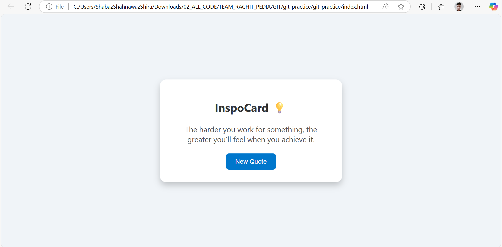

---

## 📘 Git & GetInspired – Developer Notes & Learning Summary

---

### 🧩 Stage 1 – Git Basics

#### ✅ Core Concepts

* **What is Git?**
  A distributed version control system to track file changes and collaborate on code.

* **Key Git Terminology:**

  * `repository` – your tracked project
  * `commit` – a snapshot of changes
  * `branch` – an independent line of development
  * `remote` – the GitHub (or other) hosted copy of your repo
  * `HEAD` – pointer to the latest commit

#### ✅ Core Git Commands

```bash
git init                         # Start a Git repo in current folder
git status                       # Show current tracked/untracked files
git add .                        # Stage all changes
git commit -m "Message"          # Save a snapshot of staged files
git log                          # View commit history
git diff                         # Show changes not staged yet
```

#### ✅ GitHub Integration

```bash
git remote add origin https://github.com/username/repo.git
git branch -M main
git push -u origin main
```

---
  A distributed version control system to track file changes and collaborate on code.

* **Key Git Terminology:**

  * `repository` – your tracked project
  * `commit` – a snapshot of changes
  * `branch` – an independent line of development
  * `remote` – the GitHub (or other) hosted copy of your repo
  * `HEAD` – pointer to the latest commit

#### ✅ Core Git Commands

```bash
git init                         # Start a Git repo in current folder
git status                       # Show current tracked/untracked files
git add .                        # Stage all changes
git commit -m "Message"          # Save a snapshot of staged files
git log                          # View commit history
git diff                         # Show changes not staged yet
```

#### ✅ GitHub Integration

```bash
git remote add origin https://github.com/username/repo.git
git branch -M main
git push -u origin main
```

---

### 🧩 Stage 2 – Remote Management, Push & Pull, Branching

#### ✅ Remote Commands

```bash
git remote -v                   # Check remote URLs
git push origin main            # Push local `main` branch to GitHub
git pull origin main            # Pull latest changes from GitHub
```

#### ✅ Branching

```bash
git branch                      # List local branches
git checkout -b feature/home    # Create and switch to new branch
git merge feature/home          # Merge into current branch
```

#### ✅ Fixes & Safety

* Use `.gitignore` to exclude files:

  ```bash
  echo "file_to_ignore.txt" > .gitignore
  ```
* Fix nested repo by deleting inner `.git`:

  ```bash
  rm -rf inner-folder/.git
  ```

---

## 💡 Mini Project: **GetInspired** – Quote Generator

### 🧠 Purpose:

A motivational quote generator using **HTML**, **CSS**, and **JavaScript** with Git version control and GitHub integration.

---

### 📁 Final Folder Structure:

```
GetInspiredSite/
├── index.html             # HTML UI
├── style.css              # Styling
├── script.js              # JS Quote Logic
├── GetInspiredSite.png    # Screenshot for README
├── README.md              # Project doc
```

---

### 🧠 Key Technical Learnings

#### ✅ HTML

* `<div>`, `<p>`, `<button>`, `<link>`, `<script>`
* Semantic structure for card layout

#### ✅ CSS

* Used Flexbox for center layout
* Custom styles with border-radius, box-shadow, hover effects

#### ✅ JavaScript

* Defined quote array
* Used:

  ```js
  Math.floor(Math.random() * array.length)
  ```
* DOM manipulation via `document.getElementById`
* Event handling with `onclick`

---

### 📷 README.md & Image Preview

#### ✅ Important Notes:

* Image file (`GetInspiredSite.png`) must be **in the same folder** as `README.md`
* Use correct case-sensitive markdown:

  ```markdown
  
  ```

---

### 🌐 Running the Website

* Double-click `index.html` OR
* Right-click → "Open With Browser" OR
* Use VS Code → "Open with Live Server"

---

### 🔧 Useful Git Commands Used in This Project

```bash
git init                                 # In root folder
git add .                                # Track all changes
git commit -m "Build GetInspired: Random quote generator using HTML, CSS & JS"
git branch -M main
git remote add origin https://github.com/your-username/GetInspired.git
git push -u origin main
```

### 🛠️ Fix Nested Git Repositories

```bash
cd GetInspiredSite
rm -rf .git                              # Remove nested repo
cd ..
git add GetInspiredSite
git commit -m "Fix: Removed inner .git to properly track site files"
git push
```

---

### 📚 Summary of Learning Outcomes

| Skill                          | Learned ✅ |
| ------------------------------ | --------- |
| Git Basics (init, add, commit) | ✅         |
| GitHub Remote Setup            | ✅         |
| Push, Pull, and Branching      | ✅         |
| Markdown & README Formatting   | ✅         |
| Handling `.gitignore`          | ✅         |
| Resolving Nested Git Issues    | ✅         |
| Web Dev (HTML/CSS/JS)          | ✅         |
| JavaScript DOM Manipulation    | ✅         |
| CSS Styling & Layout           | ✅         |

---

### 🧭 Next Steps (Optional)

* Add localStorage to save last quote
* Add quote API ([https://api.quotable.io/](https://api.quotable.io/))
* Convert into a Progressive Web App (PWA)
* Learn Git submodules & GitHub Actions
* Expand into a React mini project

---
